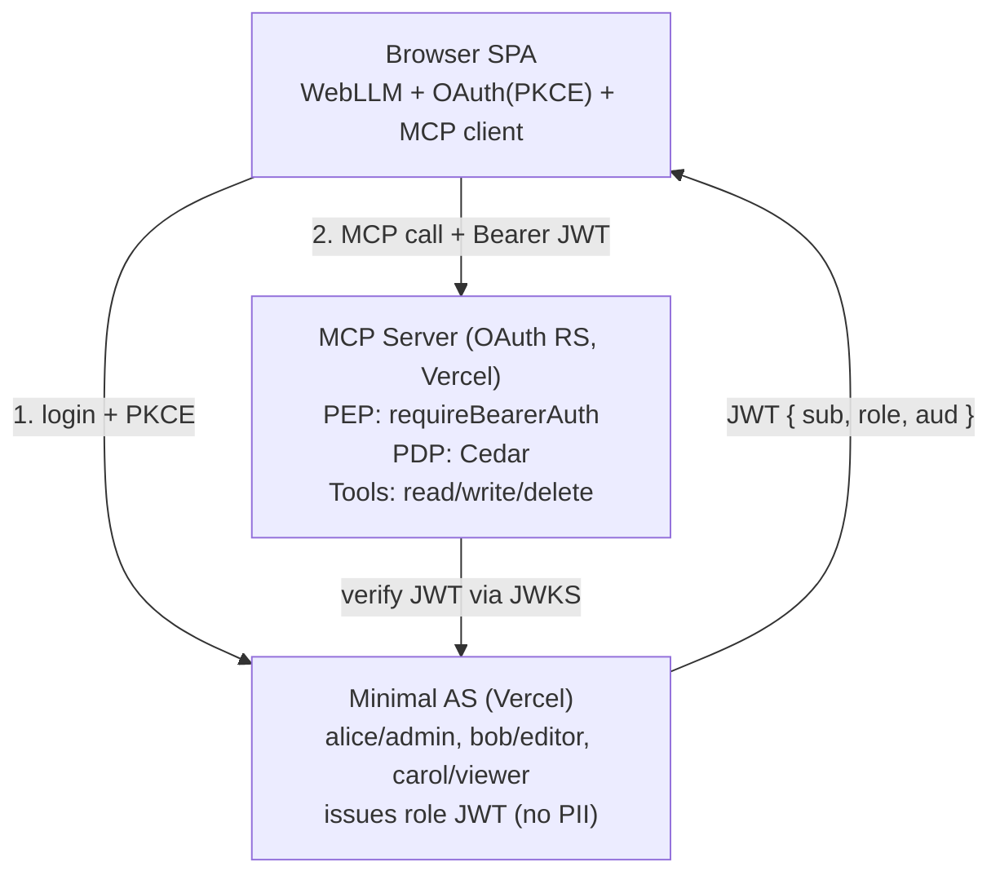
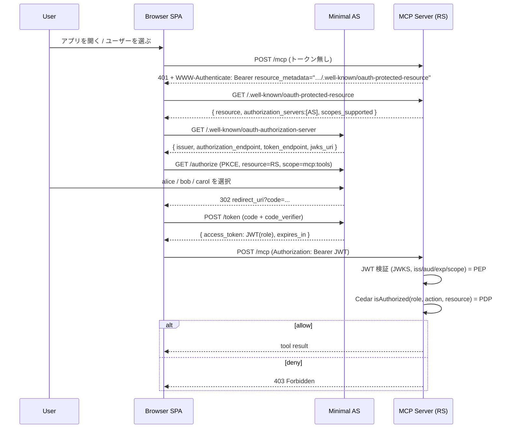

# 仕様書: WebLLM エージェント × MCP リソースサーバ × Cedar 動的認可（学習用・公開デモ）

最終更新: 2026-06-27 / バージョン: 1.0 / ステータス: ドラフト

---

## 1. 概要

ブラウザ内で動く LLM（WebLLM）をエージェントとし、そのエージェントが OAuth で保護された MCP サーバへツール呼び出しを行い、MCP サーバ内の Cedar がロールに基づいて動的に認可する、という一連の流れを学べる公開デモを構築する。

- 目的: OAuth 2.1 / OIDC・MCP の認可仕様（2025-06-18）・Cedar によるポリシーベース認可を、実物を触りながら学べる教材にする。
- 公開方針: 誰でもアクセスして体験できる。実在ユーザーの個人情報（PII）を一切扱わない。
- コスト方針: 無料枠のみで完結させる（外部の有料 IdP や有料マネージド認可サービスは使わない）。

### 1.1 最優先要件（必達）

- MCP サーバを **OAuth 2.0 リソースサーバ（RS）** として正しく動かすこと。これが満たせない構成は不可。
  - RFC 9728（Protected Resource Metadata）を提供する。
  - 外部の認可サーバ（AS）が発行したアクセストークンを検証する（自分では発行しない）。

### 1.2 非目標（スコープ外）

- 実ユーザーのサインアップ／ログイン（メール・パスワード・ソーシャルログイン）。
- 本番運用レベルの可用性・監査・鍵ローテーション運用。
- MCP の旧 SSE トランスポートへの完全対応（Streamable HTTP を主とする）。
- リフレッシュトークンの長期運用、トークンの安全な永続保管の作り込み（§12 で代替案のみ提示）。

---

## 2. 学習目標

この教材を一通り動かすと、次を体験的に理解できる。

1. MCP クライアントが保護された MCP サーバへ初回アクセスし、401 → PRM → AS メタデータ → 認可フロー、と**ディスカバリで芋づる式に AS を見つける**動き。
2. 公開クライアント（SPA）の **Authorization Code + PKCE** フロー。
3. アクセストークンの **audience（RFC 8707 resource）** を RS に固定することの意味。
4. RS が **JWKS で署名検証**し、`iss / aud / exp / scope` を確認する流れ（PEP）。
5. Cedar による **ロールベースの動的認可**（PDP）と、OAuth scope（粗い門番）との二層構造。
6. LLM がブラウザ内（WebLLM）で動き、ツール選択 → MCP 呼び出し、までをサーバ無しの推論で回す構成。

---

## 3. 全体アーキテクチャ

### 3.1 構成要素と OAuth ロール

| コンポーネント | 配置 | OAuth ロール | 主な責務 |
|---|---|---|---|
| Browser SPA | 静的ホスティング（Vercel） | OAuth クライアント（公開）／ MCP クライアント | WebLLM 推論、エージェントループ、PKCE ログイン、MCP 呼び出し |
| Minimal AS | Vercel（関数） | 認可サーバ | 匿名ログイン（3 ユーザー選択）、ロール入り JWT 発行、JWKS / メタデータ提供 |
| MCP Server | Vercel（関数） | リソースサーバ | PRM 提供、トークン検証（PEP）、Cedar 判定（PDP）、ツール実行 |

3 つを別プロジェクト（別オリジン）に分けると、ディスカバリのホップ（RS の PRM が別オリジンの AS を指す）が実物として観察でき、学習効果が高い。

### 3.2 信頼境界

- SPA はトークンを保持する公開クライアント（ブラウザ内）。トークンは base64 デコードで誰でも読めるため、**JWT に PII を載せない**。
- AS と RS は信頼関係を「共有鍵」ではなく「AS の公開鍵（JWKS）を RS が取得して検証する」非対称方式で結ぶ。
- RS はクライアントから受け取ったトークンを**上流 API へ転送しない**（confused deputy 回避、§11.6）。

### 3.3 コンポーネント図（参考）

別添 SVG: `architecture_v3_three_users_cedar.svg`



---

## 4. 認証・認可フロー（詳細）



ステップ要約:

1. **初回アクセス**: SPA がトークン無しで `/mcp` を叩くと RS は `401` と `WWW-Authenticate` を返し、`resource_metadata` で PRM の URL を示す。
2. **PRM 取得**: SPA が `/.well-known/oauth-protected-resource`（RFC 9728）を取得し、`authorization_servers` から AS を知る。
3. **AS メタデータ取得**: SPA が AS の `/.well-known/oauth-authorization-server`（RFC 8414）を取得し、各エンドポイントを知る。
4. **認可リクエスト**: SPA が PKCE で `/authorize` へ。`resource`（RFC 8707）に RS の URL、`scope=mcp:tools` を指定。
5. **匿名ログイン**: ユーザーが alice / bob / carol を選択。AS は `code` を返す。
6. **トークン取得**: SPA が `/token` で `code` + `code_verifier` を交換し、**ロール入りアクセストークン（JWT）**を受領。
7. **MCP 呼び出し**: SPA が `Authorization: Bearer <JWT>` 付きで `/mcp` を呼ぶ。
8. **検証（PEP）**: RS が JWKS で署名検証、`iss / aud（=RS）/ exp / scope` を確認。
9. **認可（PDP）**: ツール実行前に Cedar が `principal(role) / action / resource / context` で判定。`allow` なら実行、`deny` なら `403`。

---

## 5. 仮想ユーザーとロール設計

匿名 AS のログイン画面に 3 ボタンを置く。3 ユーザーはすべて架空（PII なし）。

| ユーザー（sub） | role | 説明 |
|---|---|---|
| alice | admin | 全操作可能 |
| bob | editor | 読み取り・書き込み可、削除不可 |
| carol | viewer | 読み取りのみ |

### 5.1 ロール × アクション 認可マトリクス

| role | readRecord | writeRecord | deleteRecord |
|---|:---:|:---:|:---:|
| admin | ✅ | ✅ | ✅ |
| editor | ✅ | ✅ | ❌ |
| viewer | ✅ | ❌ | ❌ |

---

## 6. 認可モデル（Cedar）

### 6.1 二層構造

- **OAuth scope（粗い認可・PEP 内）**: `mcp:tools` を持つトークンか、という門番。`requireBearerAuth` の `requiredScopes` で確認。
- **Cedar（細かい動的認可・PDP）**: 「この role がこの action をこの resource に対して実行してよいか」を都度判定。

### 6.2 Cedar スキーマ（概念）

- 名前空間: `Demo`
- エンティティ:
  - `User`: 属性 `role: String`（値は `admin | editor | viewer`）
  - `Record`: 認可対象のリソース
- アクション: `readRecord`, `writeRecord`, `deleteRecord`（適用 principal=`User`, resource=`Record`）

### 6.3 Cedar ポリシー

Cedar は「明示的に permit されない限り deny」。許可だけ記述すれば §5.1 のマトリクスに一致する。

```cedar
// 読み取り: 全ロール
permit(principal, action == Action::"readRecord", resource)
when { principal.role == "viewer" || principal.role == "editor" || principal.role == "admin" };

// 書き込み: editor と admin
permit(principal, action == Action::"writeRecord", resource)
when { principal.role == "editor" || principal.role == "admin" };

// 削除: admin のみ
permit(principal, action == Action::"deleteRecord", resource)
when { principal.role == "admin" };
```

ポリシー・スキーマはリポジトリ内のファイル（例: `policies/*.cedar`, `schema.cedarschema.json`）として管理し、RS のコードとは分離する。

### 6.4 認可リクエストのマッピング（RS 内）

| Cedar 要素 | 値の出所 |
|---|---|
| principal | JWT の `sub` →`User::"<sub>"`、属性 `role` は JWT の `role` クレーム |
| action | 呼ばれた MCP ツール名 →`Action::"<toolName>"` |
| resource | ツール引数の対象 →`Record::"<id>"` |
| context | 実行時情報（必要なら時刻・引数など。最小構成では空） |

```ts
// authInfo は requireBearerAuth が検証済みの JWT クレーム由来
const decision = await cedar.isAuthorized(
  {
    principal: { type: "User",   id: authInfo.sub },
    action:    { type: "Action", id: toolName },
    resource:  { type: "Record", id: recordId },
    context:   {},
  },
  [
    { uid: { type: "User", id: authInfo.sub },
      attrs: { role: authInfo.role },   // JWT の role
      parents: [] },
  ],
);
if (decision.type !== "allow") {
  // 403 を返す（ツールは実行しない）
}
```

---

## 7. トークン（JWT）仕様

- 形式: 署名付き JWT（推奨 `alg`: `RS256` または `ES256`、`kid` 付き）。
- 署名鍵: AS が秘密鍵で署名、公開鍵を JWKS で配布。RS は JWKS で検証。
- TTL: 短命（例 `exp` = 5〜15 分）。
- PII: 載せない。

クレーム:

| クレーム | 例 | 用途 |
|---|---|---|
| `iss` | `https://your-as.vercel.app` | 発行者。RS が一致を検証 |
| `aud` | `https://your-mcp.vercel.app` | RS の URL（RFC 8707）。RS が自分宛か検証 |
| `sub` | `alice` | 架空ユーザー識別子（Cedar principal） |
| `role` | `admin` / `editor` / `viewer` | Cedar の principal 属性 |
| `scope` | `mcp:tools` | 粗い認可。RS が必須スコープを確認 |
| `iat` / `exp` | — | 発行時刻 / 失効。短命 |

---

## 8. エンドポイント仕様

### 8.1 Minimal AS

| メソッド | パス | 説明 |
|---|---|---|
| GET | `/.well-known/oauth-authorization-server` | AS メタデータ（RFC 8414）。`issuer`, `authorization_endpoint`, `token_endpoint`, `jwks_uri`, `code_challenge_methods_supported:["S256"]` を含む |
| GET | `/authorize` | 認可エンドポイント。3 ユーザー選択 UI を表示。`response_type=code`, PKCE（`code_challenge`, `S256`）, `resource`, `scope`, `redirect_uri`, `state` を受ける |
| POST | `/token` | トークンエンドポイント。`grant_type=authorization_code`, `code`, `code_verifier`, `redirect_uri`, `client_id` を受け、ロール入り JWT を返す |
| GET | `/jwks.json` | 公開鍵（JWKS）。`jwks_uri` が指す先 |
| GET | `/.well-known/openid-configuration` | （任意）OIDC ディスカバリ。クライアント互換性のため用意してもよい |

要件:
- 公開クライアント向けに PKCE（S256）必須。`client_secret` は使わない。
- `redirect_uri` は事前登録した SPA の URL に限定（オープンリダイレクト防止）。
- ブラウザからの取得に備え、メタデータ／トークン／JWKS エンドポイントは CORS を許可。

### 8.2 MCP Server（RS）

| メソッド | パス | 説明 |
|---|---|---|
| GET | `/.well-known/oauth-protected-resource` | PRM（RFC 9728）。`resource`, `authorization_servers:[AS]`, `scopes_supported`, `bearer_methods_supported:["header"]` |
| POST | `/mcp` | MCP Streamable HTTP エンドポイント。`requireBearerAuth` で保護。トークン無効時は `401` + `WWW-Authenticate`（`resource_metadata` 付き） |

要件:
- `401`/`403` 時は `WWW-Authenticate: Bearer` に `resource_metadata` を含めてクライアントのディスカバリを助ける。
- `aud` が自分（RS の URL）でないトークンは拒否。
- CORS を SPA オリジンに限定。

---

## 9. MCP ツール仕様

最小の CRUD サブセット。リソースはインメモリ or KV（無料枠）でよい。

| ツール名（= Cedar action） | 引数 | 必要ロール | 説明 |
|---|---|---|---|
| `readRecord` | `{ id: string }` | viewer 以上 | レコード取得 |
| `writeRecord` | `{ id: string, data: object }` | editor 以上 | レコード作成/更新 |
| `deleteRecord` | `{ id: string }` | admin | レコード削除 |

各ツールハンドラの共通処理:
1. `requireBearerAuth` 通過後の `authInfo`（`sub`, `role`, `scope`）を取得。
2. ツール名を action、引数の `id` を resource として Cedar に判定依頼。
3. `allow` のみ本処理を実行。`deny` は `403` 相当のエラーを返す。

ツールは公開デモのため**無害・読み取り中心・サンドボックス**に限定し、秘密情報や破壊的操作を置かない。

---

## 10. リポジトリ / デプロイ構成

3 プロジェクト構成（推奨）:

```
/spa        ... 静的 SPA（WebLLM + OAuth client + MCP client）
/as         ... Minimal AS（Vercel 関数）
/mcp-rs     ... MCP Resource Server（Vercel 関数）
```

環境変数（例）:

| プロジェクト | 変数 | 用途 |
|---|---|---|
| as | `AS_ISSUER` | 発行者 URL |
| as | `SIGNING_PRIVATE_KEY` / `SIGNING_KID` | JWT 署名鍵 |
| as | `RESOURCE_URL` | 発行トークンの `aud` に入れる RS URL |
| as | `SPA_REDIRECT_URI` | 許可する redirect_uri |
| mcp-rs | `AS_ISSUER` / `AS_JWKS_URI` | トークン検証の発行者・JWKS |
| mcp-rs | `RESOURCE_URL` | 自分の `aud`（一致検証用） |
| mcp-rs | `SPA_ORIGIN` | CORS 許可オリジン |
| spa | `AS_BASE_URL` / `MCP_URL` / `CLIENT_ID` | フロー先・MCP 先・事前登録クライアント ID |

クライアント登録: SPA は 1 つだけ AS に**事前登録**（公開 DCR は「誰でもクライアント登録可」になるためデモでは使わない）。

---

## 11. セキュリティ要件（公開前提）

1. **audience 固定**: トークンの `aud` を RS の URL に固定し、RS は自分宛のみ受理。他所への使い回しを防ぐ。
2. **短命トークン**: `exp` を数分に。
3. **デフォルト拒否**: Cedar は permit が無ければ deny。RS も検証失敗時は確実に拒否。
4. **CORS 限定**: RS / AS は SPA オリジンに限定。
5. **レート制限**: Vercel Firewall 等で基本的なレート制限・濫用対策。
6. **トークン非転送（confused deputy 回避）**: RS はクライアントのトークンを上流 API へ転送しない。上流呼び出しが必要なら別途トークンを取得。
7. **PII ゼロ**: JWT・ログに実在の個人情報を残さない。ユーザーは架空。
8. **HTTPS / redirect_uri 検証**: 認可系は HTTPS。`redirect_uri` は事前登録値に限定。
9. **ツールの無害化**: 破壊的操作・秘密情報・外部副作用を持たない。
10. **ブラウザ内トークンの限界**: 公開クライアントのためトークンはブラウザに乗る（学習用途では許容）。堅牢化したい場合は §12 の BFF 案へ。

---

## 12. WebLLM の制約と対策

- **WebGPU 必須**: Chrome / Edge 113+ 等。非対応環境向けに WASM フォールバック（wllama 等）か、その旨の案内 UI を用意。
- **モデルサイズ**: 量子化で実質 ~8B 程度が上限。初回はモデルのダウンロードが走る（以降キャッシュ）。
- **function calling が WIP**: WebLLM のツール呼び出しは preliminary。安定運用のため、ツール対応の instruct モデル（Qwen2.5 / Llama 3.x 系等）を使い、`tools` 任せにせず **JSON モードで「ツール名と引数」を構造化出力 → 自前でパース**する手動方式を採る。
- **エージェントループ**: モデル出力 →（ツール呼び出し JSON 抽出）→ MCP `tools/call` → 結果をモデルへ戻す、を繰り返す。

### 12.1 任意の堅牢化（BFF 案・スコープ外）

WebLLM はブラウザのまま、OAuth クライアントと MCP クライアントを Vercel の薄い BFF に寄せ、ブラウザはセッション Cookie のみ保持する構成へ差し替え可能。リフレッシュトークンをブラウザ外（モデル文脈外）に置けるため、より仕様の推奨に沿う。

---

## 13. 技術スタック / 依存

| プロジェクト | 主な依存 |
|---|---|
| spa | `@mlc-ai/web-llm`, `@modelcontextprotocol/sdk`（クライアント）, PKCE/OAuth ヘルパ（軽量実装可） |
| as | `jose`（JWT 署名・JWKS 生成）, 軽量フレームワーク（Hono / Express）on Vercel 関数 |
| mcp-rs | `@modelcontextprotocol/sdk`（`StreamableHTTPServerTransport`, `mcpAuthMetadataRouter`, `requireBearerAuth`）, `jose`（検証）, `@cedar-policy/cedar-wasm` または `@cedar-policy/cedar-authorization` |

注意:
- MCP トランスポートは**ステートレス Streamable HTTP** を選び、SSE 用の Redis を不要にする（無料維持）。
- `cedar-wasm` は WASM のため、Vercel 関数のバンドルから漏れないようバンドラ設定で外部化が必要な場合がある。

---

## 14. 受け入れ条件 / 動作確認シナリオ

| # | 前提（ユーザー） | 操作 | 期待結果 |
|---|---|---|---|
| 1 | （未ログイン） | トークン無しで `/mcp` | `401` + `WWW-Authenticate`（`resource_metadata` 付き） |
| 2 | alice (admin) | `readRecord` | allow（成功） |
| 3 | alice (admin) | `deleteRecord` | allow（成功） |
| 4 | bob (editor) | `writeRecord` | allow（成功） |
| 5 | bob (editor) | `deleteRecord` | **deny / 403** |
| 6 | carol (viewer) | `readRecord` | allow（成功） |
| 7 | carol (viewer) | `writeRecord` | **deny / 403** |
| 8 | 任意 | `aud` 不一致トークンで `/mcp` | 拒否（`401`/`403`） |
| 9 | 任意 | 期限切れトークンで `/mcp` | `401` |
| 10 | 任意 | PRM → AS メタデータの順に取得 | 各 well-known が正しい JSON を返す |

ディスカバリ確認の例:

```
curl -s https://your-mcp.vercel.app/.well-known/oauth-protected-resource | jq .
curl -s https://your-as.vercel.app/.well-known/oauth-authorization-server | jq .
```

---

## 15. 既知の制約・将来拡張

- 認可仕様は学習向けに 2025-06-18 をベースにする。2025-11-25 版では DCR より **CIMD（Client ID Metadata Documents）** が既定方向になったが、本デモは事前登録クライアントで十分。
- 実ログイン（OIDC でのソーシャルログイン等）を足す場合も、`sub` 以外の PII を保存しなければ公開のまま運用できる。
- マルチリソース・複数 AS・ステップアップ認可（追加スコープ要求）などは将来拡張。
- 監査ログ・鍵ローテーション・トークン失効リストは本デモでは扱わない。

---

## 16. 用語集

| 用語 | 意味 |
|---|---|
| AS（Authorization Server） | アクセストークンを発行する「トークン工場」。本デモは自前の匿名 AS。 |
| RS（Resource Server） | トークンを検証して保護リソースを提供する側。本デモでは MCP サーバ。 |
| PEP（Policy Enforcement Point） | 認可を「実施」する門番。本デモでは `requireBearerAuth`。 |
| PDP（Policy Decision Point） | 認可を「判定」する者。本デモでは Cedar。 |
| PRM | Protected Resource Metadata（RFC 9728）。RS が AS の場所等を広告する。 |
| PKCE | 公開クライアント向けの認可コード横取り防止（S256）。 |
| JWKS | AS の公開鍵集合。RS が JWT 署名検証に使う。 |
| Cedar | オープンソースのポリシー言語／認可エンジン。RS 内（in-process）で評価。 |

---

## 17. 参考仕様

- MCP Authorization（2025-06-18）: MCP サーバを OAuth 2.1 リソースサーバとして定義。
- RFC 9728: OAuth 2.0 Protected Resource Metadata。
- RFC 8414: OAuth 2.0 Authorization Server Metadata。
- RFC 8707: Resource Indicators for OAuth 2.0（`resource` / audience）。
- OAuth 2.1（draft）: 認可フローの基盤（PKCE 必須等）。
- Cedar: ポリシー言語・認可エンジン（Apache-2.0）。
- WebLLM（MLC）: ブラウザ内 LLM 推論（WebGPU、OpenAI 互換 API）。
